# Task1 zabbix_mihura

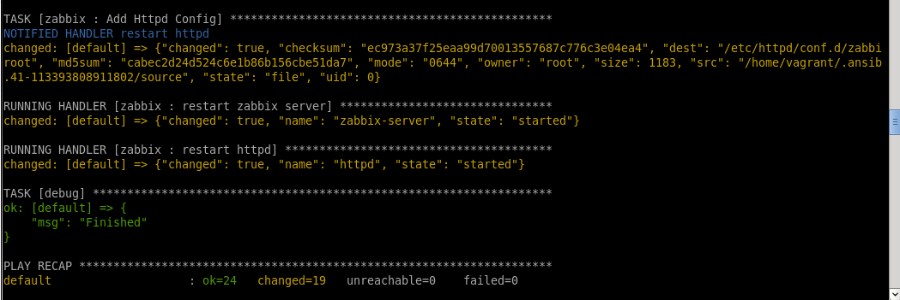

1. Screenshot with result of execution SQL statement “select userid,alias,name,passwd,refresh from users where alias like 'Admin'; 
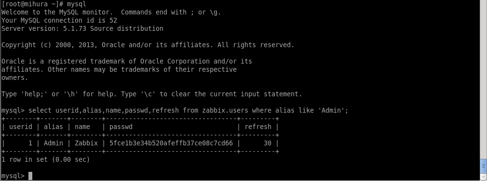

2. Screenshot with tab “Monitoring->Latest data” for host Zabbix_server (group:all).
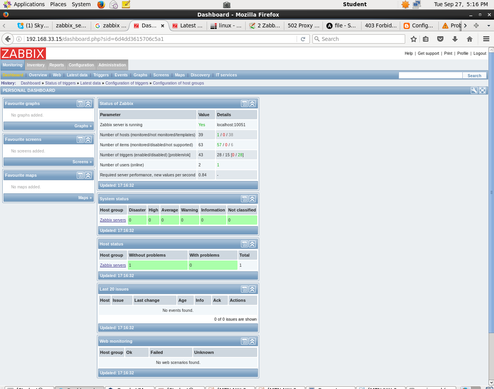
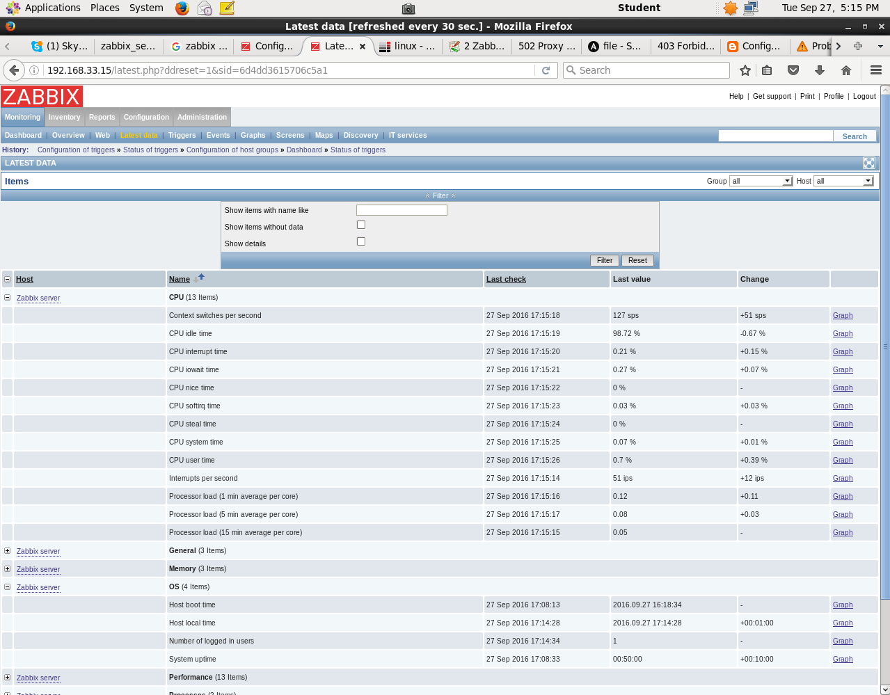

3. Screenshot with tab “Configuration->Hosts” (group:all)
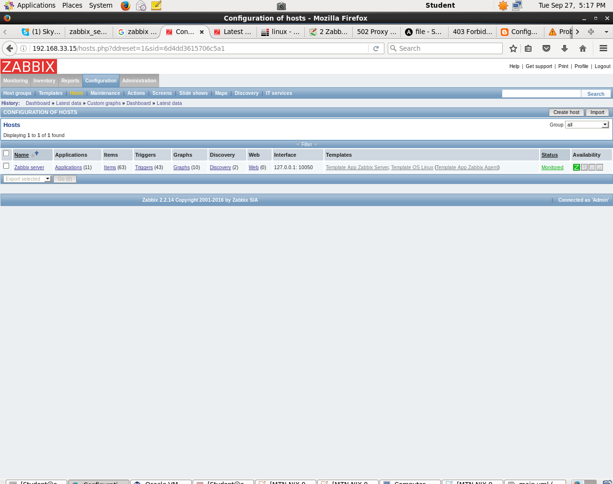

4. Screenshot with triggers list, tab “Latest data” with collected data.
5. Screenshot with tab “Latest data” with collected data.
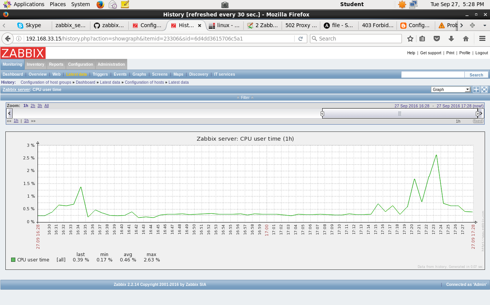
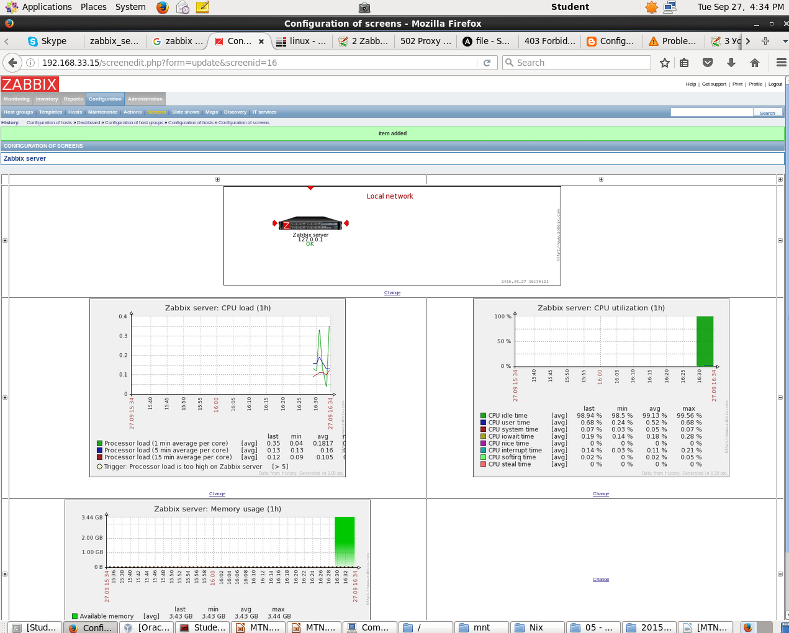
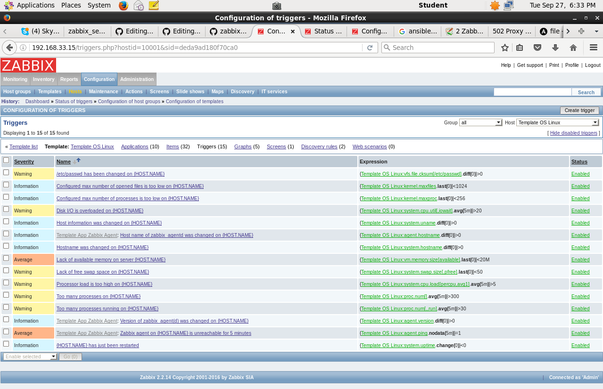

6. Screenshot with active items.
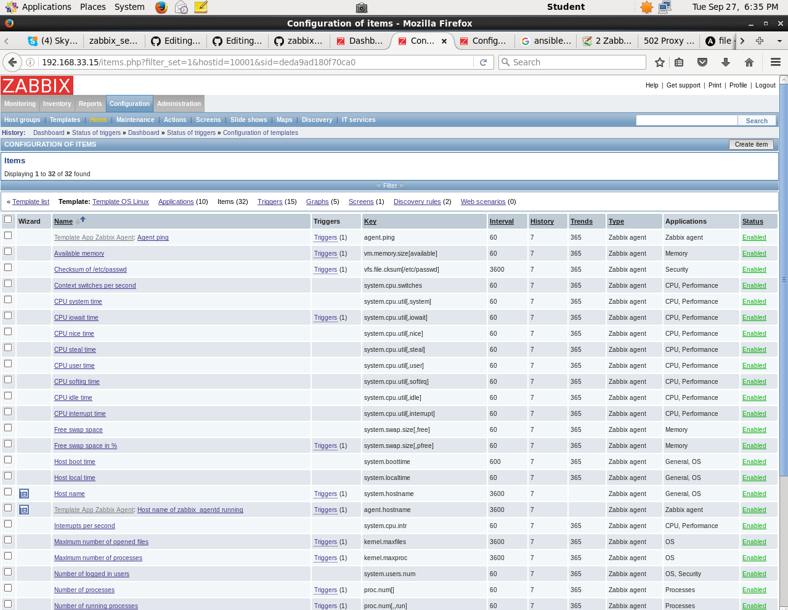

7. Screenshot with “Monitoring->Triggers” with trigger history.
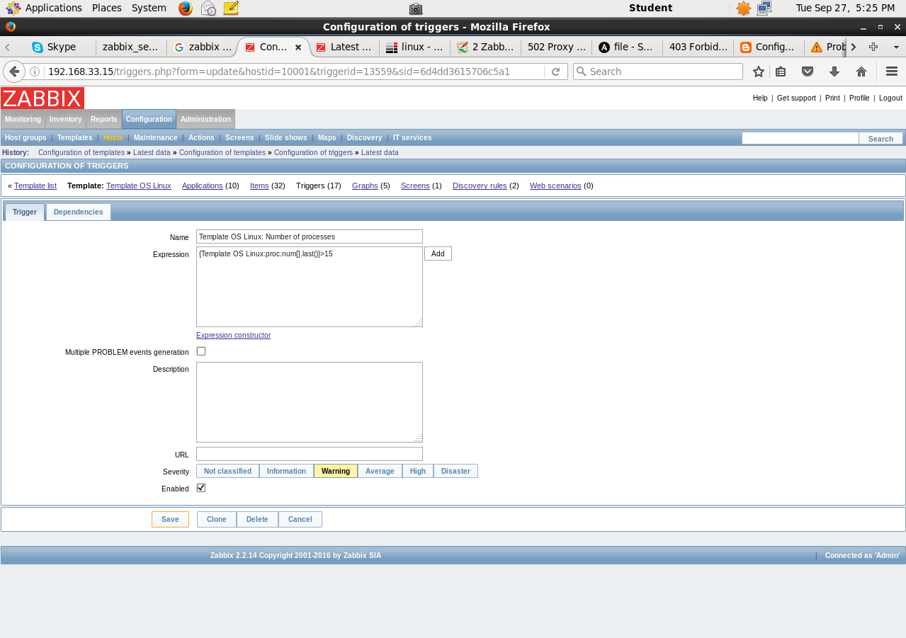
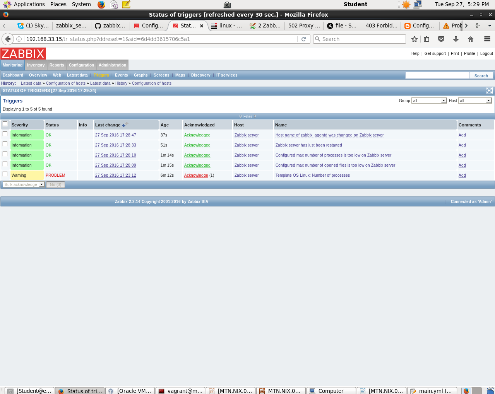

8. Screenshot with process of using zabbix_sender and with server reply. (Important: use zabbix_sender with key –vv for maximal verbosity)
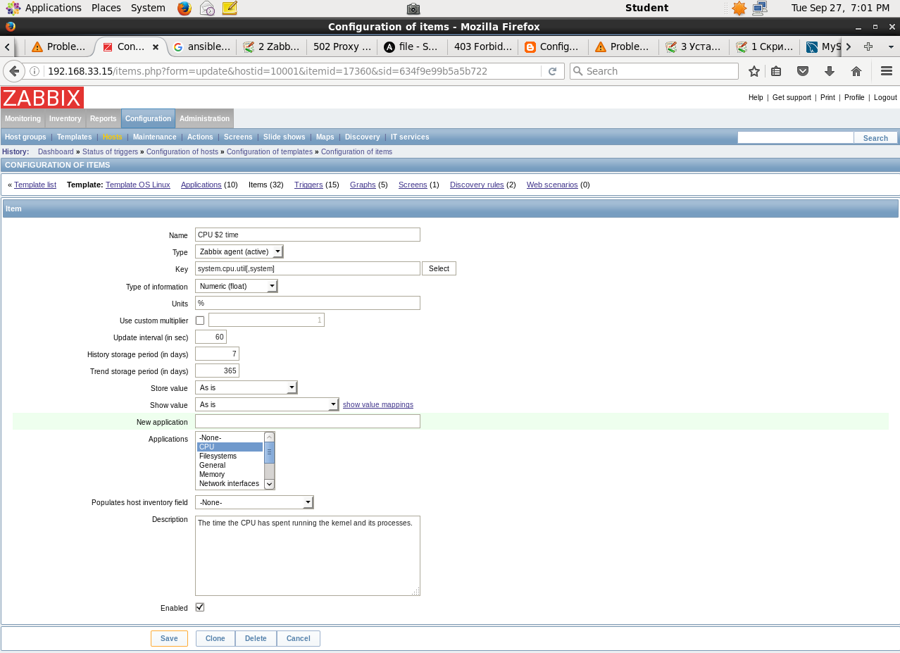
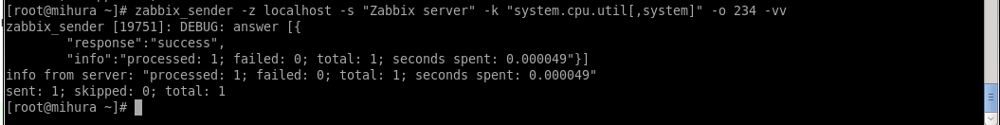

9. Screenshot with process of using zabbix_get and with agent reply.
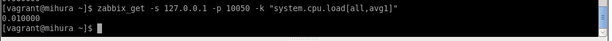
