# Task3 zabbix_mihura

 <b>1. Screenshot with UserParameter in agent config and corresponding item in host config</b> 
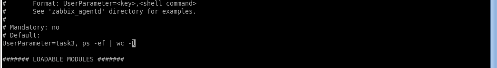
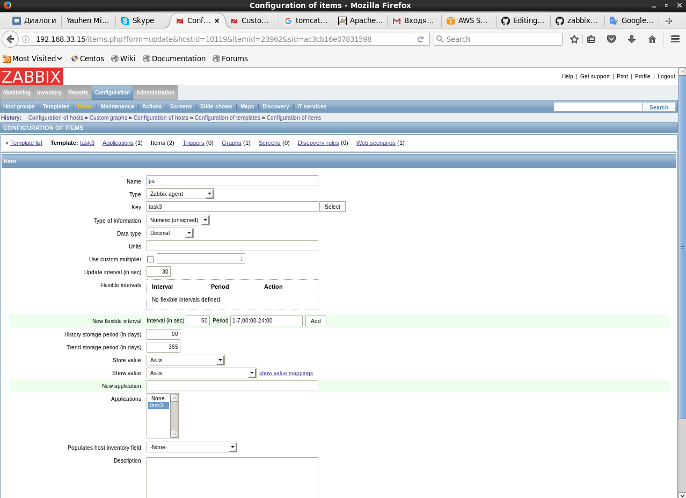

 <b>2. Attach external script to the report. Screenshot with “Latest data” tab with data for item for that external script.</b> 
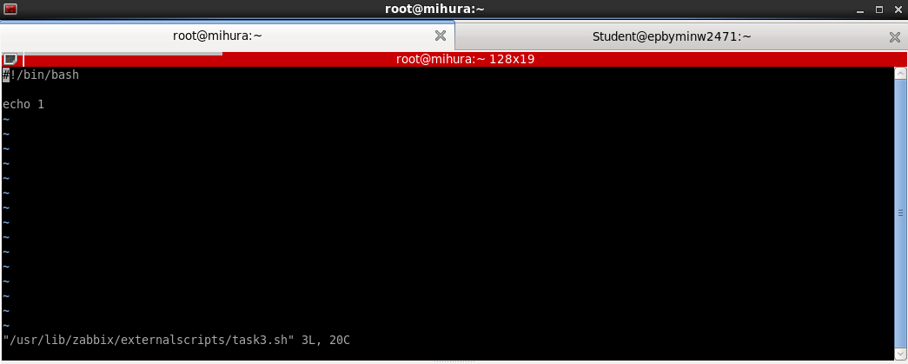
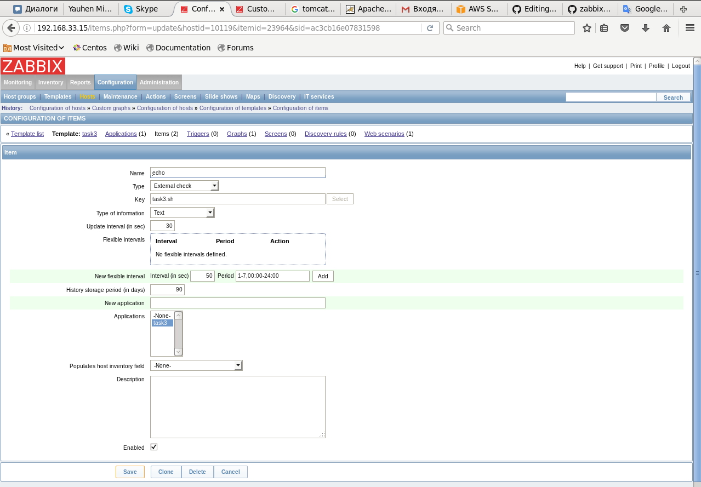

 <b>3. Screenshot with “Latest data” tab in “History” view for collected data with log monitoring.</b> 
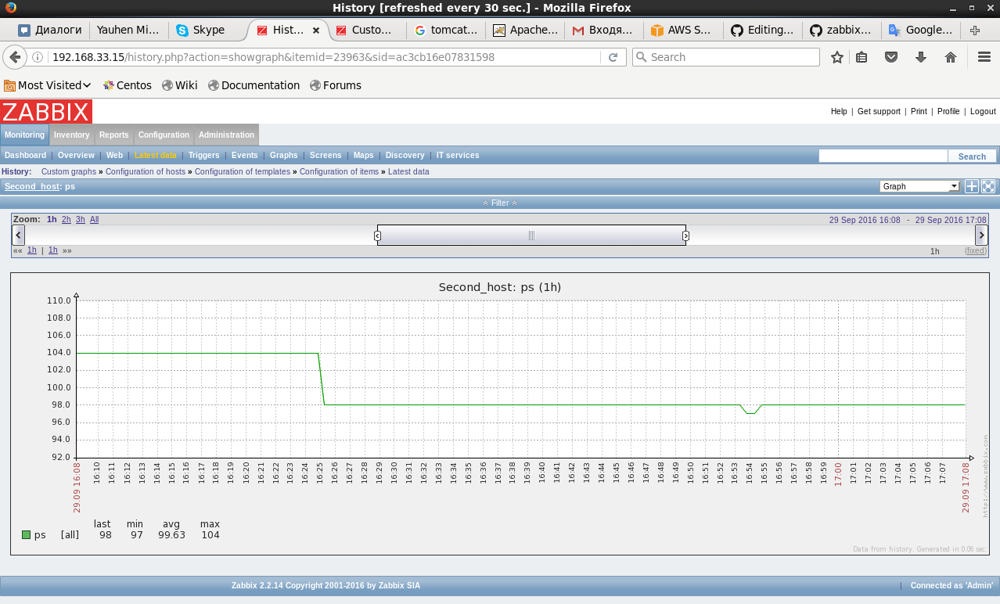
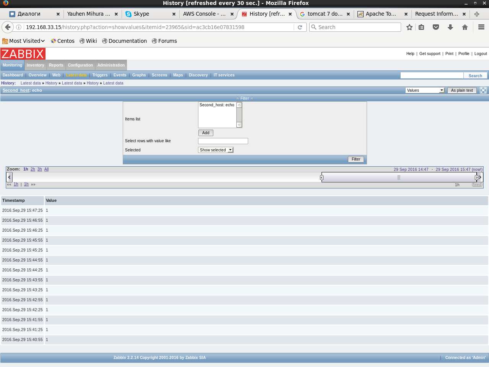

 <b>4. Screenshot with graphics with speed and response time for website.</b> 
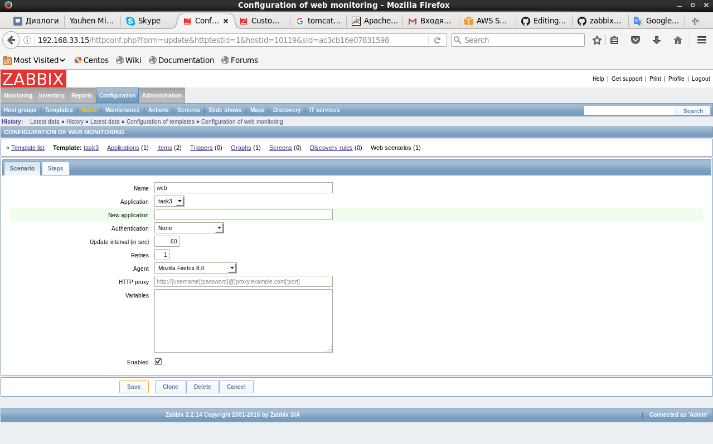
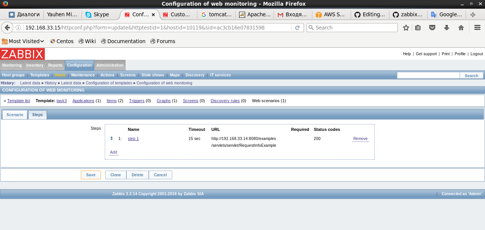
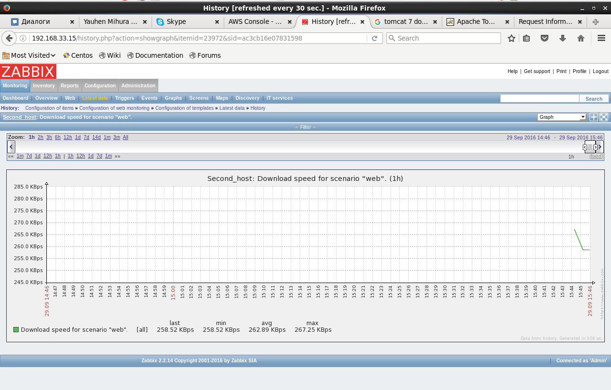
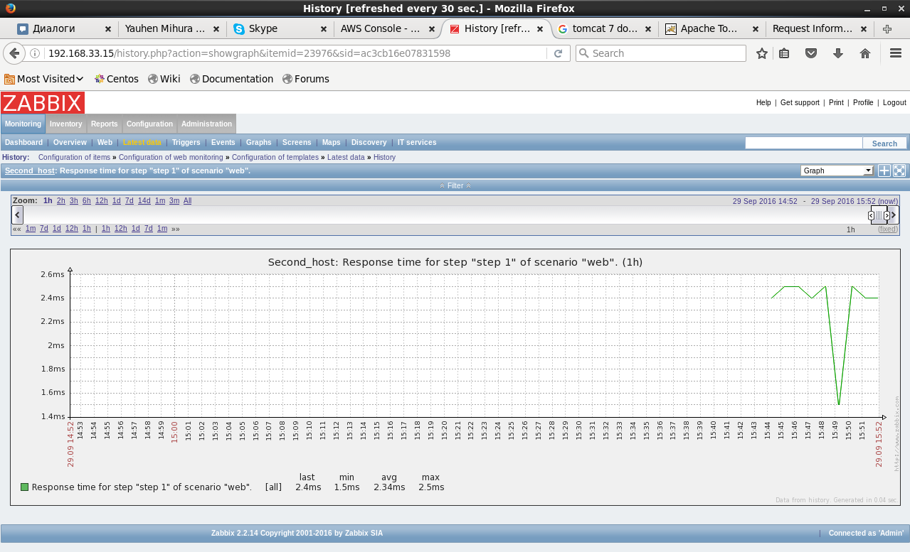

 <b>5. Screenshot with “Latest data” tab with collected data.</b> 

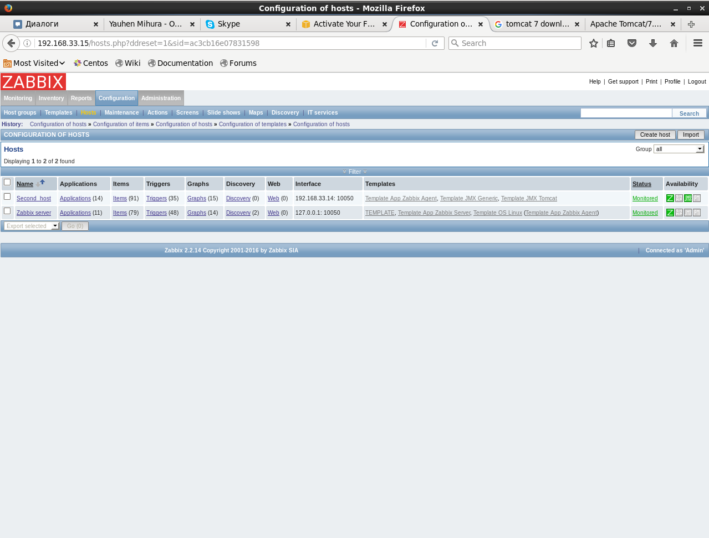

 <b>6. Screenshot with graphics.</b> 
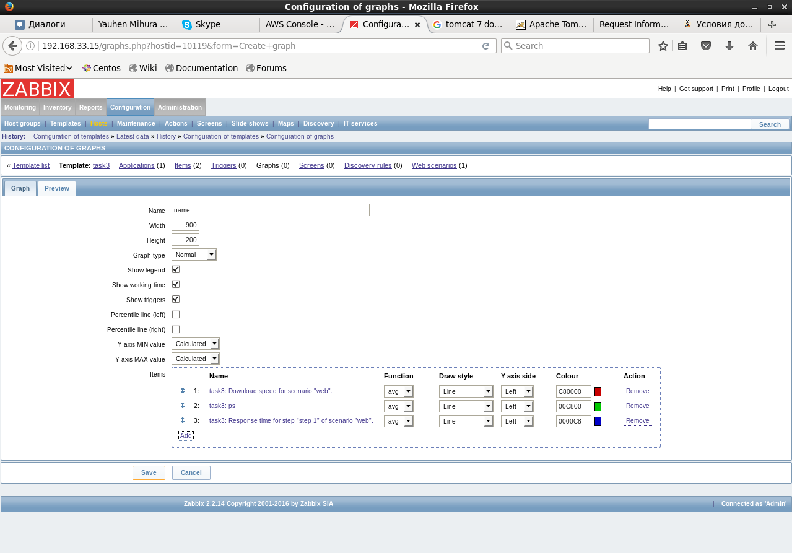
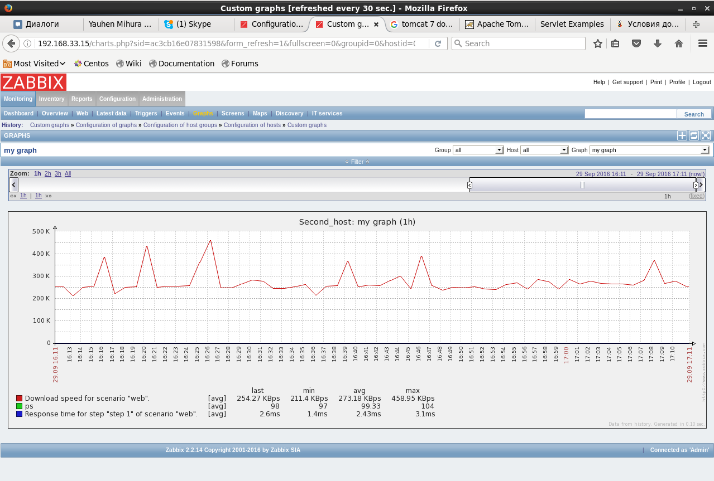
